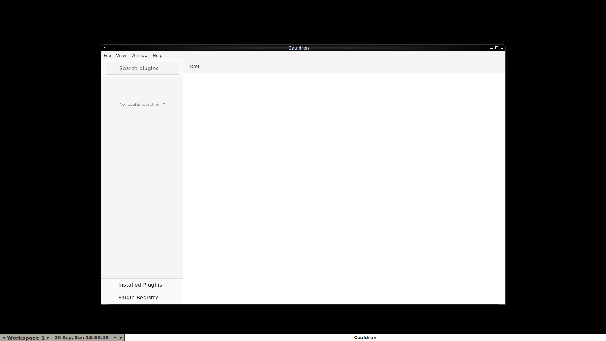
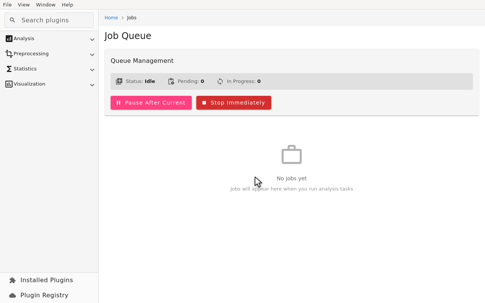
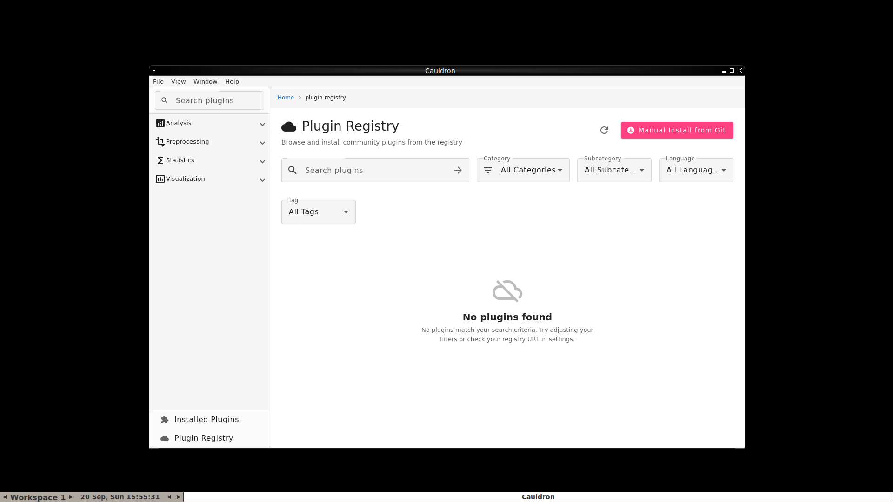
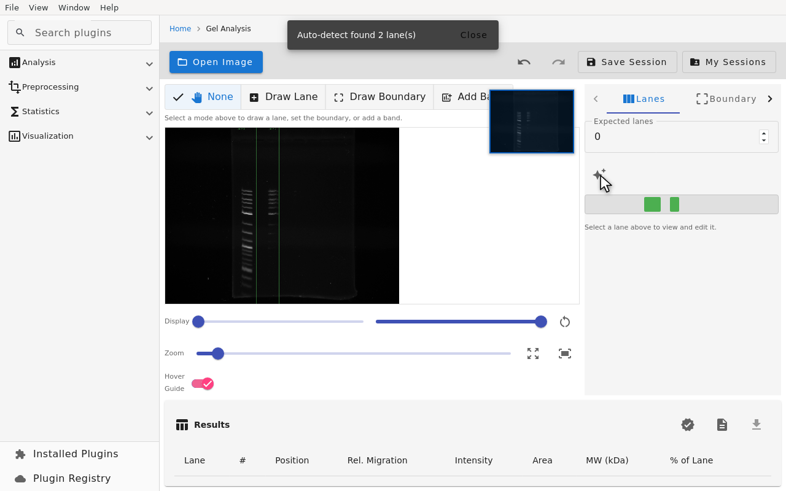
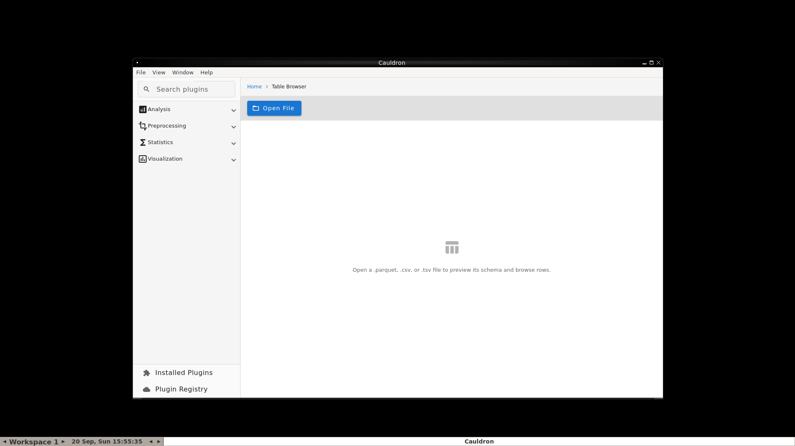
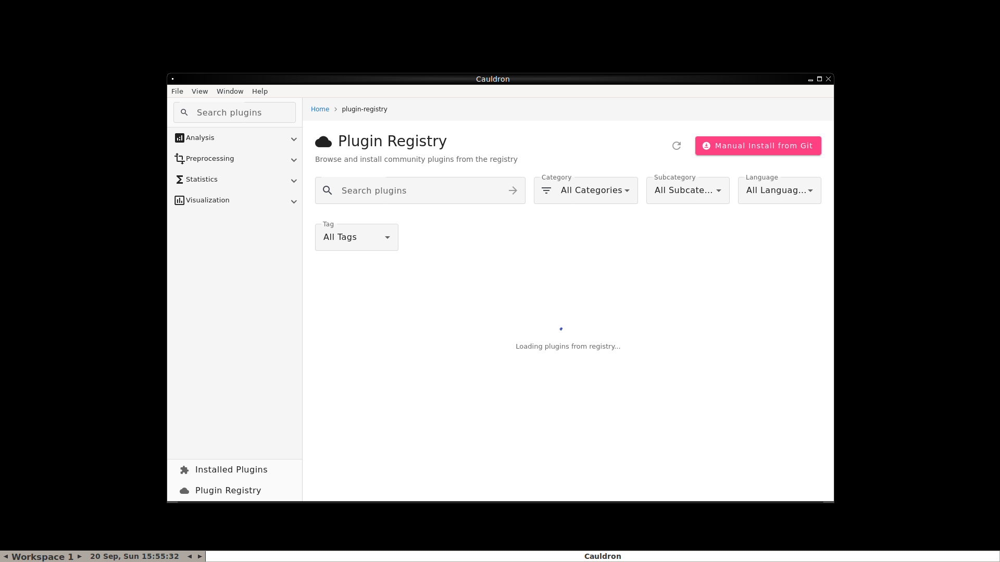
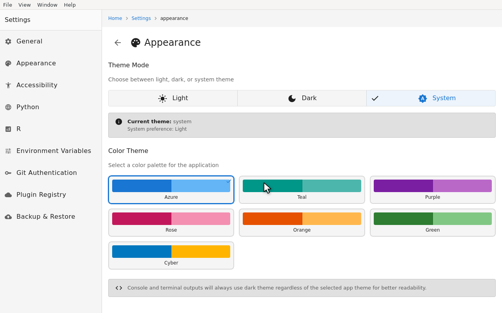
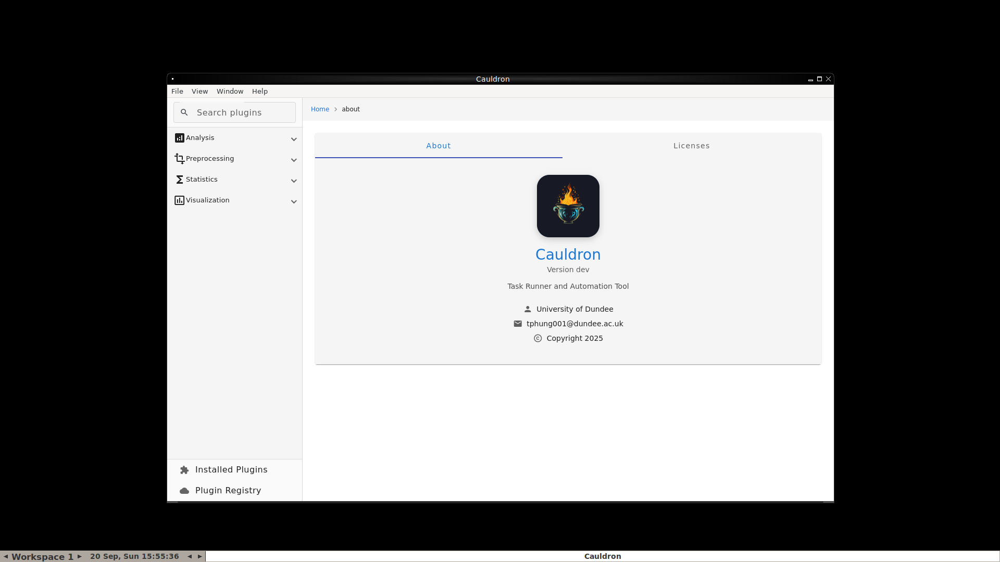

# CauldronGO

A proteomics data visualization and analysis desktop application built with Wails v3, Go, and Angular.

## Screenshots

| | |
|---|---|
|  Home |  Job Queue |
|  Plugin Registry |  Gel Analysis |
|  Table Browser |  Settings: General |
|  Settings: Appearance |  About |

These are regenerated automatically by `.github/workflows/screenshots.yml` and opened as a PR whenever the workflow runs.

## Overview

CauldronGO is a desktop application for proteomics data analysis. Rather than shipping a fixed set of analyses, it runs any tool describable as a plugin: a `plugin.yaml` manifest declares the tool's parameters, its runtime environment (Python, R, or Docker), and how to invoke it, and CauldronGO handles argument building, execution, job tracking, and result rendering. The app ships with a library of real bundled plugins (`plugins/`) covering PCA, PHATE, differential analysis, gel image processing, format conversions, and more, and can install additional plugins from a remote registry or a Git repository.

### Key Features

- **Plugin-driven analysis engine:** any Python, R, or Docker-based tool can be added as a plugin without touching the Go or Angular code (see [Plugin System](#plugin-system))
- **Plugin Registry:** browse and install community plugins from a remote registry, with filtering by category, subcategory, language, and tag
- **Gel Analysis:** lane/band detection and molecular weight calibration for gel images
- **Table Browser:** inspect and explore tabular data files
- **Job Queue:** background execution with real-time progress, terminal output streaming, and rerun support
- **Environment Management:** detects and switches between Python and R environments (including virtualenvs/renv) per job
- **Settings Backup & Restore:** export/import app configuration, optionally including secrets
- **Git-authenticated plugin installs:** install plugins from private Git repositories via configured credentials

## Technology Stack

### Backend
- **Go 1.25:** application backend
- **Wails v3 (beta):** desktop application framework, native webview + Go/TS bindings
- **GORM + SQLite:** persistent storage for settings, jobs, environments, and plugin state

### Frontend
- **Angular 22:** application UI, zoneless signals-based components
- **Angular Material:** component library
- **Plotly.js** (via `angular-plotly.js`): interactive plots

### Processing Engines
- **Python:** most bundled plugins, per-plugin dependencies
- **R:** statistical plugins (e.g. limma, QFeatures)
- **Docker:** plugins that need an isolated or non-Python/R runtime

## Plugin System

Every analysis in CauldronGO is a plugin: a directory under `plugins/` containing a `plugin.yaml` manifest plus the script(s) it runs. The manifest declares the plugin's parameters, its runtime `environments` (`python`, `r`), and its `entrypoint`.

- [`docs/PLUGIN_DEVELOPER_GUIDE.md`](docs/PLUGIN_DEVELOPER_GUIDE.md): writing a plugin, scaffolding, workflow/step markers, validation
- [`docs/COMMAND_EXECUTION_REFERENCE.md`](docs/COMMAND_EXECUTION_REFERENCE.md): exactly how parameters become command-line arguments
- [`docs/PLUGIN_INSTALLATION.md`](docs/PLUGIN_INSTALLATION.md): installing plugins via protocol handler, HTTP, or Git (including private repos)
- [`docs/PLUGIN_PLOT_SYSTEM.md`](docs/PLUGIN_PLOT_SYSTEM.md) / [`docs/plugin-plots-guide.md`](docs/plugin-plots-guide.md): how plugin output gets rendered as plots
- [`schemas/PLUGIN_YAML_REFERENCE.md`](schemas/PLUGIN_YAML_REFERENCE.md): full field-by-field `plugin.yaml` reference, generated from `schemas/plugin-schema.json`

`cmd/` has the supporting CLI tools (run any of them with `--help`): `plugin-scaffolder` (generate a new plugin from a template), `plugin-validator` (validate a `plugin.yaml` against the schema), `plugin-migrate`, `plugin-to-nextflow`, `plugin-to-slivka`, `plugin-to-spa` (convert plugins to other formats), `plugin-doc-generator`, `schema-doc-generator`.

## Getting Started

### Prerequisites

#### Required
- **Go 1.25 or higher:** [Download](https://go.dev/dl/)
- **Node.js v22.23.1** (see `.nvmrc` at the repo root, `nvm use` to switch): [Download](https://nodejs.org/)
- **Wails CLI:** `go install github.com/wailsapp/wails/v3/cmd/wails3@v3.0.0-beta.15`
- **Linux only:** GTK4 4.10+ and WebKitGTK 6.0 dev headers (`libgtk-4-dev libwebkitgtk-6.0-dev` on Debian/Ubuntu). Not available by default on Ubuntu 22.04 LTS, Debian 12, Fedora ≤ 39, or RHEL 9.x. Those need the legacy `-tags gtk3` build path instead (`libgtk-3-dev libwebkit2gtk-4.1-dev`), supported by Wails through the v3.0.x line only.

#### Optional (for running plugins)
- **Python 3.10+:** [Download](https://www.python.org/downloads/). Required by Python-based plugins; each plugin declares its own dependencies (see its `requirements.txt`)
- **R 4.2+:** [Download](https://cran.r-project.org/). Required by R-based plugins

### Installation

1. **Clone the repository**
   ```bash
   git clone https://github.com/noatgnu/cauldron-go.git
   cd cauldron-go
   ```

2. **Install Go dependencies**
   ```bash
   go mod download
   ```

3. **Install frontend dependencies**
   ```bash
   cd frontend
   npm install
   cd ..
   ```

4. **Run in development mode**
   ```bash
   ./build.sh dev
   ```

Plugin dependencies (Python/R packages) are installed per plugin, not globally. See [`docs/PLUGIN_INSTALLATION.md`](docs/PLUGIN_INSTALLATION.md).

### Building for Production

All building goes through `build.sh` (`./build.sh help` for the full command list):

```bash
# Build shared-lib, frontend, tools, and the Wails app for the current/default platform
./build.sh

# Build for a specific platform
./build.sh wails windows/amd64
./build.sh wails linux/amd64
./build.sh wails darwin/amd64
./build.sh wails darwin/arm64

# Build every supported platform at once
./build.sh all-platforms
```

The built application will be in `build/bin/`.

## Database Schema

CauldronGO uses SQLite with GORM for persistent storage. The database is automatically created at:
- **Linux:** `~/.config/cauldron/cauldron.db`
- **macOS:** `~/Library/Application Support/cauldron/cauldron.db`
- **Windows:** `%APPDATA%\cauldron\cauldron.db`

Core tables:

**settings**
- `key` (PRIMARY KEY): Setting name
- `value`: Setting value

**jobs**
- `id` (PRIMARY KEY): Job UUID
- `type`, `name`, `status` (pending/in_progress/completed/failed), `progress`
- `command`, `args`, `parameters`: what was run and with what parameters
- `pythonEnvPath`/`pythonEnvType`, `rEnvPath`/`rEnvType`: which environment ran the job
- `pluginVersion`, `pluginCommitHash`: which plugin version produced the result
- `outputPath`, `terminalOutput`: results and captured output
- `createdAt`, `startedAt`, `completedAt`, `error`

**imported_files**
- `id` (AUTO INCREMENT), `name`, `path`, `size`, `importedAt`, `fileType`, `preview`

Plus supporting tables for Python/R environment tracking, custom environment variables, Git authentication, Docker plugin images, the plugin registry cache, and gel analysis sessions. See `AutoMigrate()` in `backend/services/database.go` for the full, current list.

## Configuration

Default settings:

```json
{
  "pythonPath": "/usr/bin/python3",
  "rPath": "/usr/bin/Rscript",
  "rLibPath": "",
  "resultStoragePath": "~/.config/cauldron/results",
  "curtainBackendUrl": "https://celsus.muttsu.xyz",
  "pluginRegistryUrl": "https://cauldron.proteo.info"
}
```

All settings are also editable from the app under **Settings**: General, Appearance, Accessibility, Python, R, Environment Variables, Git Authentication, Plugin Registry, and Backup & Restore.

## API Reference

Go↔TypeScript bindings are generated, not hand-maintained: `wails3 generate bindings -ts` (run automatically by `build.sh`) reads every exported method on `App` in `app.go` and produces the TypeScript client in `frontend/bindings/`. That generated output is the authoritative API reference. Read it directly rather than a hand-copied list here.

### Events

Real-time events emitted to the frontend (see `emitEvent` calls in `app.go` and `backend/services/`):

- `job:update`, `job:output`: job status/progress and streamed terminal output
- `queue:status`: job queue state changes
- `file:imported`: a file finished importing
- `plugin:install:start`/`progress`/`success`/`error`, `plugin:installed`, `plugin:uninstall:success`: plugin install/uninstall lifecycle
- `plugin:install:request`: protocol-handler-triggered install request
- `protocol:success`/`protocol:error`: OS protocol handler results
- `unfinished-jobs-found`: resumable jobs found on startup

## Development

### Adding a New Analysis

1. Scaffold a plugin: `go run ./cmd/plugin-scaffolder` and follow the prompts (or copy an existing plugin under `plugins/` as a starting point)
2. Implement the script and declare its parameters/environment in `plugin.yaml`
3. Validate it: `go run ./cmd/plugin-validator plugins/<your-plugin>/plugin.yaml`
4. Run it from the app's plugin execution page. No Go or Angular changes needed

See [`docs/PLUGIN_DEVELOPER_GUIDE.md`](docs/PLUGIN_DEVELOPER_GUIDE.md) for the full walkthrough.

### Database Migrations with GORM

GORM handles migrations automatically. To add new fields, update the model struct in `backend/models/` or `backend/services/database.go` and restart the app. To add a new table, add the struct to the `AutoMigrate()` call in `backend/services/database.go`.

## Troubleshooting

### Python not detected
- Ensure Python 3.10+ is installed
- Check PATH environment variable
- Manually set the path under Settings → Python

### R not detected
- Ensure R 4.2+ is installed
- Check PATH for Rscript
- Manually set the path under Settings → R

### Jobs fail to execute
- Check the job's terminal output in the Job Queue
- Verify the plugin's own dependencies are installed (see its `requirements.txt`)
- Check file permissions

### Database errors
- Delete `cauldron.db` and restart (resets settings)
- Check disk space and write permissions

## Contributing

1. Fork the repository
2. Create feature branch (`git checkout -b feature/amazing-feature`)
3. Commit changes
4. Push to branch
5. Open Pull Request

## Credits

- **Original Cauldron:** [noatgnu/cauldron](https://github.com/noatgnu/cauldron)
- **Wails:** [wailsapp/wails](https://github.com/wailsapp/wails)
- **Angular:** [angular/angular](https://github.com/angular/angular)
- **GORM:** [go-gorm/gorm](https://github.com/go-gorm/gorm)

## References

- [Wails Documentation](https://wails.io/docs/)
- [GORM Documentation](https://gorm.io/docs/)
- [Plugin Developer Guide](docs/PLUGIN_DEVELOPER_GUIDE.md)
- [Plugin YAML Reference](schemas/PLUGIN_YAML_REFERENCE.md)
- [Original Cauldron](https://github.com/noatgnu/cauldron)
